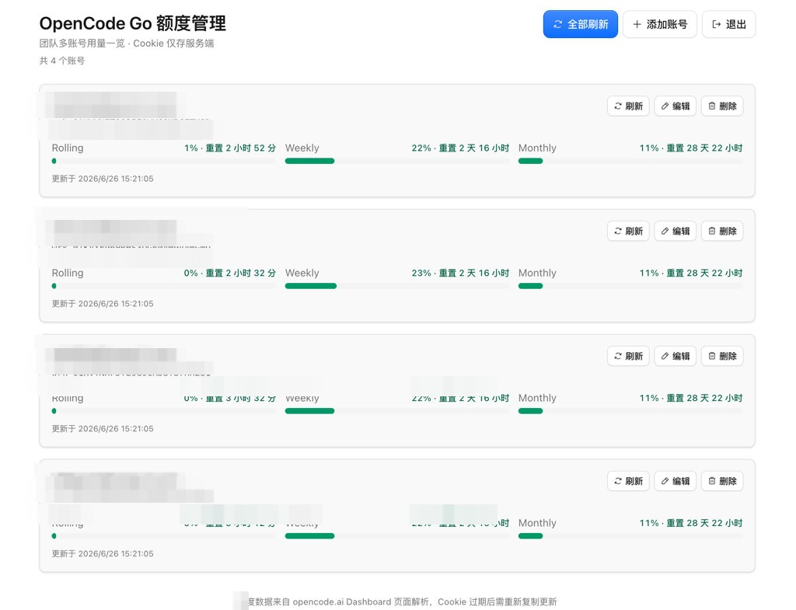

# OpenCode Go Dashboard

OpenCode Go Dashboard 是一个基于 Cloudflare 全技术栈的自托管额度查询面板。它集中展示多个 OpenCode Go 账号的 Rolling / Weekly / Monthly 用量，Auth Cookie 仅保存在服务端 D1，不会返回给浏览器。

## 功能预览

以下截图使用脱敏示例数据，账号名称、Workspace ID 和更新时间已打码处理。



## 功能

- 密码保护的管理后台。
- 多账号增删改查。
- 一键刷新单个或全部账号额度。
- 用量接近上限时高亮提示。
- 部署在 Cloudflare Workers，全球边缘节点访问。
- 前端 React + Kumo，后端 Worker API，数据存储 D1，一套 `wrangler deploy` 完成部署。

## 快速开始

下面这组命令可以在本地完成构建和预览。生产部署前需要先创建 D1 数据库并配置管理密码。

```bash
git clone https://github.com/Ruinique/opencode-go-dashboard.git
cd opencode-go-dashboard
npm install
cp .dev.vars.example .dev.vars
# 编辑 .dev.vars，设置 ADMIN_PASSWORD
npm run db:migrate:local
npm run preview
```

默认在 `http://localhost:8787` 启动，同时运行 Worker API 和前端静态资源。

仅开发前端 UI（不经过 Worker）：

```bash
npm run dev
```

如果希望让 AI agent 直接帮你部署，可以把下面这段作为提示词发给它：

```text
请帮我部署 opencode-go-dashboard：从 https://github.com/Ruinique/opencode-go-dashboard.git 克隆项目并安装依赖；登录 Cloudflare（wrangler login）；创建 D1 数据库 opencode-go-dashboard 并把 database_id 写入 wrangler.jsonc；通过 wrangler secret put ADMIN_PASSWORD 设置管理密码；执行 npm run db:migrate:remote 完成迁移；最后运行 npm run deploy 部署到 Cloudflare Workers，并告诉我访问地址。
```

## 配置

### 前置要求

- [Node.js](https://nodejs.org/) 20+
- [Cloudflare 账号](https://dash.cloudflare.com/sign-up)
- [Wrangler CLI](https://developers.cloudflare.com/workers/wrangler/) v4+

### D1 数据库

```bash
npx wrangler login
npx wrangler d1 create opencode-go-dashboard
```

命令会输出 `database_id`，将其填入 `wrangler.jsonc` 中 `d1_databases[0].database_id`，替换默认占位符 `00000000-0000-0000-0000-000000000000`。

### 环境变量

| 变量 | 含义 | 设置方式 |
| --- | --- | --- |
| `ADMIN_PASSWORD` | 管理后台登录密码 | `.dev.vars`（本地）/ `wrangler secret`（生产） |

本地开发：

```bash
cp .dev.vars.example .dev.vars
```

编辑 `.dev.vars`：

```env
ADMIN_PASSWORD=your-strong-password-here
```

生产环境：

```bash
npx wrangler secret put ADMIN_PASSWORD
```

## 部署到 Cloudflare

确保已完成 D1 创建、密码配置和数据库迁移，然后执行：

```bash
# 生产环境迁移
npm run db:migrate:remote

# 构建并部署
npm run deploy
```

部署成功后，Wrangler 会输出访问地址，形如 `https://opencode-go-dashboard.<your-subdomain>.workers.dev`。

### 绑定自定义域名（可选）

在 `wrangler.jsonc` 中取消注释 `routes` 配置，将 `dashboard.example.com` 替换为你的域名：

```jsonc
"routes": [
  {
    "pattern": "dashboard.example.com",
    "custom_domain": true
  }
]
```

域名需已在 Cloudflare 账号中，然后重新执行 `npm run deploy`。

## 使用说明

1. 打开部署后的地址，输入 `ADMIN_PASSWORD` 登录。
2. 点击「添加账号」，填写：
   - **显示名称**：便于识别的备注名
   - **Workspace ID**：格式为 `wrk_xxx`，可在 OpenCode 工作区 URL 中找到
   - **Auth Cookie**：从浏览器开发者工具中复制 `auth` Cookie 值（以 `Fe26.` 开头）
3. 点击「刷新」或「全部刷新」获取最新额度。
4. Cookie 过期后，编辑对应账号并粘贴新的 Cookie。

### 获取 Auth Cookie

1. 在浏览器中登录 [opencode.ai](https://opencode.ai)
2. 打开开发者工具 → Application（或 Storage）→ Cookies
3. 找到 `auth` Cookie，复制其值

## 项目结构

```
├── src/
│   ├── client/          # React 前端
│   └── worker/          # Cloudflare Worker API
├── migrations/          # D1 数据库迁移
├── wrangler.jsonc       # Cloudflare Workers 配置
├── .dev.vars.example    # 本地环境变量示例
└── index.html
```

## 隐私边界

本面板需要你在服务端存储 OpenCode 的 Auth Cookie 才能查询额度。Cookie 具有账号访问权限，请仅部署在受信任的环境中，并使用强密码保护管理后台。不要将 `.dev.vars` 提交到版本控制，也不要在公开场合分享 Cookie 或管理密码。

额度数据来自 opencode.ai Dashboard 页面解析，OpenCode 页面结构变更时可能需要更新代码。

## 许可证

[MIT License](LICENSE)

## 社区

本开源项目已链接并认可 [LINUX DO 社区](https://linux.do)。